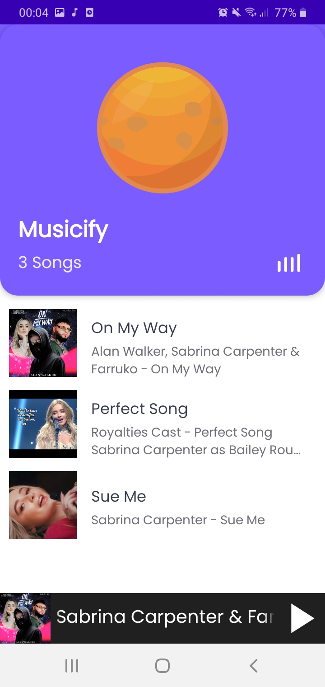

# Musicify
**Musicify** is an **Audio Streaming App** just like spotify. It takes songs and their metadata from cloud storage and plays them in the app using **Exoplayer**. 

### Project Purpose
The purpose of this project is to demonstrate how can a person:
* Upload songs, their thumbnail images and other meta data on cloud and fetch the data to their app and show it in a listview or recyclerview.
* Play, pause, skip, change and seek the songs using Android Exoplayer along with seekbar, viewpager and other Android UI components.
* Start a foreground service and display a realtime notification where you can see and control the currently playing song. 
* Use MVVM Architecture along with Dependency Injection and well optimized code writing habits to develop a project that is easy to debug, maintain and scale.
 

Below I have explained the flow of app. Moreover, I have also commented what I am doing in a particular function or class in the app's source code so that one can easily understand it. In any case if you do not understand something, feel free to contact me.

### Project Setup
#### Adding Dependencies
Before we get started, we need to add the following dependencies to your build.gradle app

* [Coroutines](https://developer.android.com/kotlin/coroutines) - Coroutines are used to perform two or more tasks parallely or asynchronously. They are very useful when you need to load data from cloud into your app.
* [Firebase Storage KTX](https://firebase.google.com/docs/storage) - For storing songs and their thumbnail images, I have used firebase storage. This storage is free for non commercial projects and can be easily used in your app without the need to create any API.
* [Firebase Firestore](https://firebase.google.com/docs/firestore) - Firebase firestore is a NoSQL Database. You can use it to store the metadata about your song such as title, subtitle, duration, Song Url and Thumbnail Url in this database.
* [Firebase Coroutines](https://developer.android.com/kotlin/coroutines) - If you want to access data from firebase to your app asynchronously, this dependency will let you use coroutines with firebase code.
* [ExoPlayer](https://developer.android.com/guide/topics/media/exoplayer) - Exoplayer is a library that is used to access Android's native Media Player. It is much better than Android's Default MediaCodec API and is used by many major apps such as Netflix, Spotify, Twitter, Twitch etc...
* [Dagger Hilt](https://developer.android.com/training/dependency-injection/hilt-android) - Dagger Hilt is a library that provides an abstraction over Dagger. We will use this library to implement Dependency Injection in our app.
* [Lottie](https://lottiefiles.com/) - Lottie is another popular library developed by Airbnb. It makes it extremely easy to import and play .json format animations in our app.
* [Glide](https://github.com/bumptech/glide) - Glide is an image loading library. It makes it really easy to load images from cloud into our app. Moreover, we can also set placeholder and error images and also change the quality of images.
* [Architectural Components](https://developer.android.com/topic/architecture) - To use Viewmodel in our app, we will use this library.
* [Navigation Component](https://developer.android.com/guide/navigation/navigation-getting-started) - This is the Android's library that makes it really easy to navigate from one fragment to another.
* [Google Material Design](https://material.io/develop/android) - This library provides a huge collection of ready to use beautiful UI components that are much better than Android's default UI components.
* [Timber](https://github.com/JakeWharton/timber) - Timber is a library that helps you in debugging your code by logging messages at different parts of your code. It is much more efficient than the default Log() method.

### App Architecture

I have used MVVM architecture in this app. The flow of the app is as follows:

1. MusicService.kt 
This file contains functions to create the notification, prepare the exoplayer and create the music service.

2. MusicServiceConnection.kt 
This file contains functions to start and end our music service and connect the media browser.

3. MainViewModel.kt 
This file contains functions to play, pause and skip the songs as well as all the live data variables.

4. SongViewModel.kt 
This file contains function to update the music seekbar.

5. MusicifyActivity.kt 
This is the MainActivity of our app that is the gateway to our fragments. Moreover, this file also contains code to play and swipe change the songs through viewpager.

6. HomeFragment.kt 
This file displays list of all the songs in recyclerview.

7. SongFragment.kt 
This file contains the code to control the music through playback control code written in ViewModels.

### Helper Classes
These are some of the classes I created to optimize my code a little more and perform some more tasks:
1. FirebaseMusicSource.kt 
This file contains the code to get data from firebase storage to the app.

2. MediaMetadataCompat.kt 
Exoplayer can only process songs in a class that comes with it. It is called MediaMetadataCompat. This class contains information about all the music properties such as song name, subtitles, authors, duration etc. However there are many properties of this class that are not required in this app. So I created a Song.kt file that will only contain the properties needed for this app and then I created .toSong() function to convert MediaMetadataCompat file to Song.kt file. 

3. PlaybackStateCompat.kt 
This file contains extention variables to get the current state of a song: Playing/ Paused/ Prepared as well as an extension variable to get current playback position of a song.

### Callbacks
1. MusicNotificationListener.kt 
This file will execute certain functions when a notification is displayed or removed.

2. MusicPlayerEventListener.kt 
This file will start and stop our service whenever we play or pause our song.

3. MusicPlaybackPreparer.kt 
This file contains the function to prepare our exoplayer from the firebase storage's song url received through FirebaseMusicSource.kt.

### Dagger Hilt related files
1. AppModule.kt 
This file contains the objects we only need as long as our application lives.

2. ServiceModule.kt 
This file contains the objects we only need as long as our service lives.

3. MusicifyApplication.kt 
This file provides Application Context to all our functions.

### Other important files
1. Resource.kt 
This file tells us the state of a particular event such as loading of music, is music successfully loaded or if there is any error.

2. Event.kt 
This file helps us know if we have handled a particular object or not.

3. Constants.kt 
This file contains all the constant variables we require in our app.

### Cloud Architecture
In firebase storage, I have uploaded all the songs .mp3 files along with their thumbnail .jpg files.

In firebase database, I have stored meta data of all the songs including their firebase storage's song url and thumbnail image url. 
 

## Contact
For any queries, you can mail me at developerishant710@gmail.com
